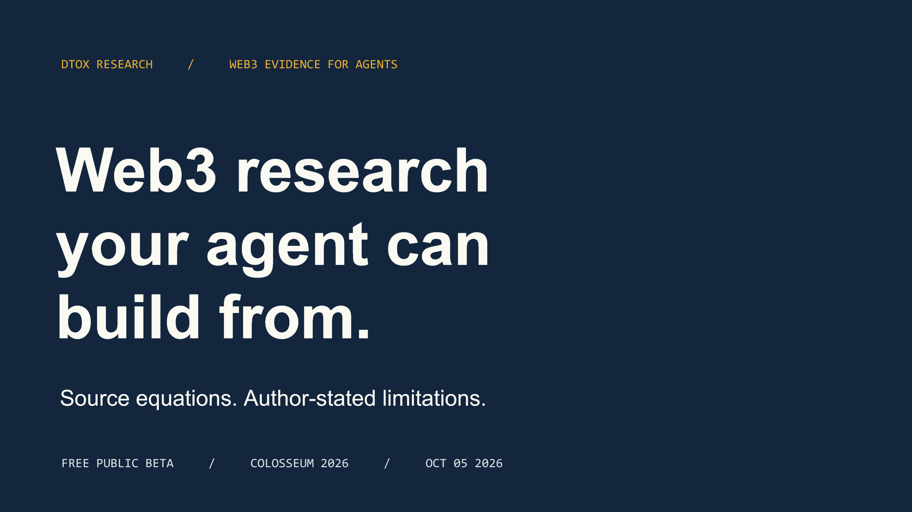

<p align="center">
  
</p>

# dtox research

**Web3 research your agent can build from.** A free MCP research service with embeddings-based vector search over structured papers and protocol specifications, returning cited evidence for agents and builders.

[Live research](https://read.whoim.space/research/) · [Free MCP endpoint](https://read.whoim.space/mcp) · [Technical reference](docs/technical-reference.md) · [Pitch deck](presentation/pitch-2026-10-05/dtox-research-pitch.pptx)

## The problem

Web3 engineering knowledge is scattered across papers, EIPs/ERCs, Solana SIMDs, and technical documents. A general-purpose agent can find a promising abstract, miss an equation or security caveat, and present a nearby paper as proof. Builders need source evidence they can inspect.

## The solution

dtox combines curated Web3 research and protocol specifications with embeddings-based vector retrieval over structured passages. Agents can search papers and sections, retrieve equations or code when available, follow citation links, and inspect provenance, scope, and authors’ stated limitations. Coverage varies by record: some sources provide full text, others only abstracts. It is a research aid, not a universal patent or novelty oracle; a match is a candidate to inspect, and no result does not prove no prior work exists.

## Why Solana

Wallet-signed readings can be recorded as Solana devnet SAS attestations. A signature attributes a reading to a wallet; it does not prove truth, scientific correctness, or independent consensus.

| Network | Evidence status |
| --- | --- |
| Solana devnet | Historical SAS attribution and USDC x402 transaction evidence |
| Base Sepolia, Ethereum Sepolia, Arbitrum Sepolia | Test-network configuration exists; live end-to-end settlement validation is pending |
| Mainnet | Not deployed or assessed |

## What builders can do

- Search across Web3 papers, EIPs/ERCs, Solana SIMDs, and adjacent AI-agent, LLM/SLM, and builder-technology research.
- Retrieve paper sections, structured equations, code/math specifications, and bounded research bundles with provenance.
- Compare methods, explore research trends, and validate a project against retrieved evidence.
- Keep abstract-only fallbacks and source limitations visible instead of implying full-text coverage.
- Optionally submit wallet-attributed readings; unsigned public registry writes are disabled.

## Stack

Python · FastAPI · SQLite (WAL/FTS5) · Qdrant · ONNX embeddings · PyMuPDF4LLM · pylatexenc · FastMCP (Python) · Solana SAS · x402. TypeScript is used by the attestor and x402 gateway.

## Architecture

```text
Papers · EIPs/ERCs · Solana SIMDs · technical documents
                         │
            ingest · parse · provenance
                         │
       SQLite FTS5 + Qdrant + citation graph
                         │
       FastAPI research API ── MCP read tools
                         │
             AI agents and builders

Optional, separate paths:
wallet-signed reading ── attestor ── Solana devnet SAS
paid x402 surface ───── payment gateway (deployment status varies)
```

## Quick start

Connect an MCP-compatible client to the public, free endpoint:

```bash
# Codex
codex mcp add dtox --url https://read.whoim.space/mcp

# Claude Code
claude mcp add --transport http dtox https://read.whoim.space/mcp
```

Then ask your agent to discover available papers first, read the source, and report its evidence and limitations. For example: “Find research relevant to account abstraction, inspect the most relevant source and its limitations, and distinguish direct evidence from inference.” Paper availability is not guaranteed; use returned provenance and abstract-only markers. See the [technical reference](docs/technical-reference.md) for all 13 tools and self-hosting notes.

## Roadmap

- **Built:** public research beta, structured retrieval, provenance and scope signals, free MCP access, and historical Solana devnet attribution/payment evidence.
- **Next:** external pilot and repeat-use feedback; complete and verify EVM paid-payment end-to-end flows; review mainnet safety before any production expansion.

These are product milestones, not customer traction or a commitment to a launch date. More detail: [pitch roadmap](docs/pitch-roadmap.md).

## Evidence snapshot · as of 2026-10-05 09:30Z

**180,833 indexed documents** · **17,365 Web3 documents** · **10,801,846 indexed chunks**

Counts describe indexed records and chunks, not customers, active usage, or universally available full text. The live [stats endpoint](https://read.whoim.space/research/stats.json) is the source for current counts; snapshot values can change.

## Resources

- [Live research interface](https://read.whoim.space/research/)
- [MCP endpoint](https://read.whoim.space/mcp)
- [Pitch deck PDF](presentation/pitch-2026-10-05/dtox-research-pitch.pdf)
- [Editable pitch deck](presentation/pitch-2026-10-05/dtox-research-pitch.pptx)
- [Browser deck file](presentation/pitch-2026-10-05/index.html) (download/open locally; not hosted as a live web page)
- [Judges’ guide: proof, boundaries, and alternatives](docs/judges-guide.md)
- [Full technical reference and original README](docs/technical-reference.md)
- [AGPL-3.0 license](LICENSE)
- [Project and maintainer profile](https://github.com/who1900/dtox-research)

## Founder

Daniyar Gabdullin · Solo founder. Independent mobile/Web3/AI engineer since 2019, with blockchain and wallet QA experience. Previous Solana mobile work includes SeekerVault and X-Booster/Aibat. [Portfolio](https://portfolio.whoim.space/) · [LinkedIn](https://www.linkedin.com/in/daniyar-gabdullin-11312b252/) · [CV](https://portfolio.whoim.space/Daniyar_Gabdullin_CV.pdf)

---

**License:** [GNU AGPL-3.0](LICENSE).
